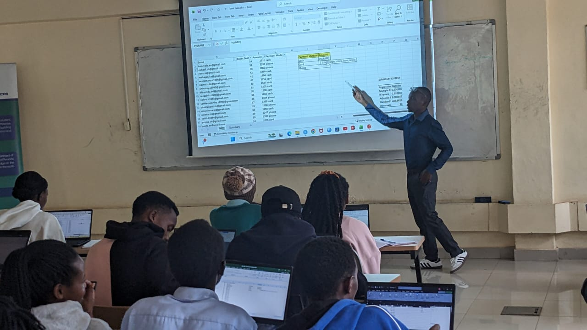
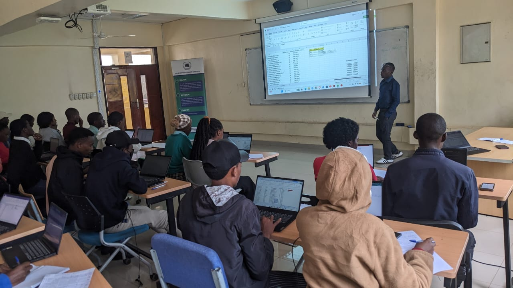
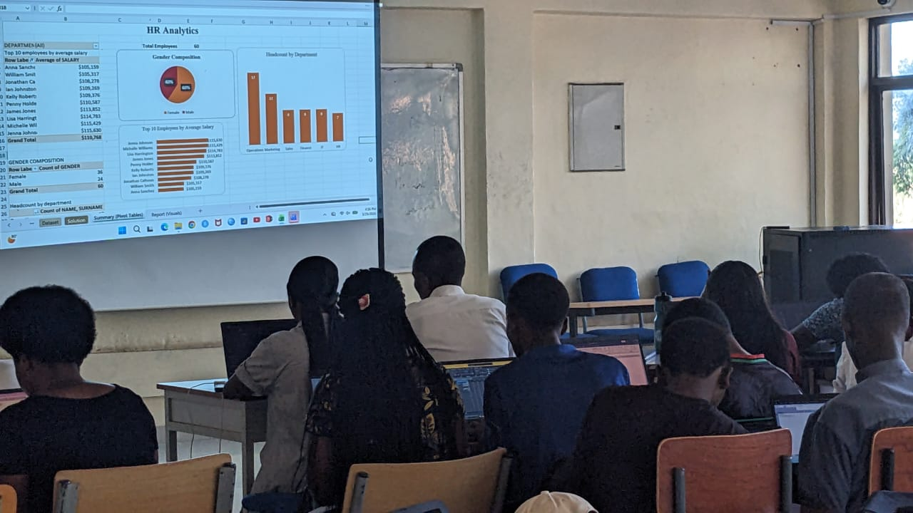

# 📊 Microsoft Excel Training Project – UR Huye Campus

This repository documents a 3-day Microsoft Excel training program delivered at UR Huye Campus, where I represented EduConnect Rwanda. The training was organized to equip participants from diverse academic backgrounds with practical and industry-relevant Excel skills for data handling, analysis, and reporting.

Throughout the sessions, the training focused on building a strong foundation and gradually advancing to more practical and analytical concepts. Participants engaged in hands-on exercises, real-world datasets, and interactive discussions aimed at strengthening their problem-solving and data analysis capabilities.

## 📸 Training Sessions

## 👥 Participants

The training covered the following key areas:

- Data entry and validation  
- Formulas and functions  
- Data analysis techniques  
- Power Query for data transformation  
- Pivot Tables and Pivot Charts  
- Data visualization  

The sessions emphasized practical application, enabling participants to clean, transform, analyze, and present data effectively using Microsoft Excel. By the end of the program, participants demonstrated significant improvement in their ability to work with data and generate insights.

This repository also includes supporting materials such as training datasets, exercises, screenshots from sessions, and a short video highlight, providing a comprehensive overview of the training experience and outcomes.

## 📸 Training Highlights

Images and videos from the sessions are included to showcase participant engagement, hands-on activities, and the overall learning environment during the training.

## 🎯 Objective

The main objective of this training was to empower participants with practical data skills that can be applied in academic work, research, and professional environments.

## 🚀 Outcome

The training successfully enhanced participants’ confidence and competence in using Excel for data-driven tasks, preparing them for more advanced tools and real-world applications.
